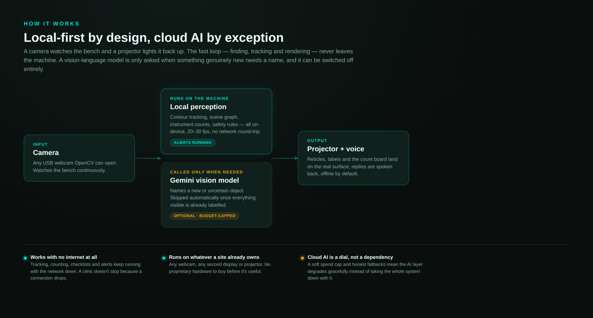
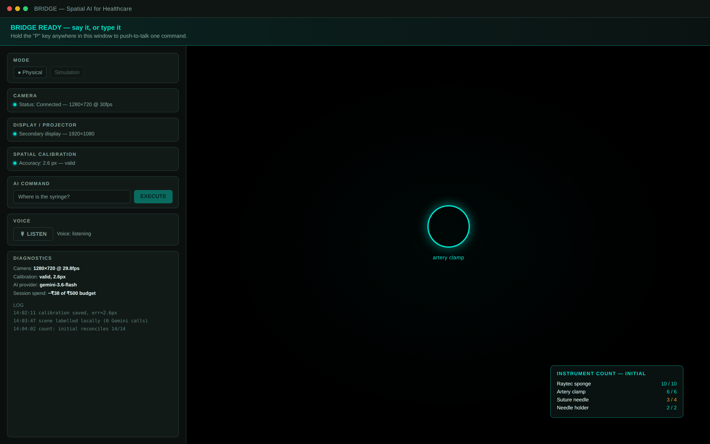

# BRIDGE — Spatial AI for Healthcare

**B**rain **R**easoning **I**ntelligence **D**irected into **G**rounded **E**nvironments

> Don't bring the human into the computer. Bring the computer's intelligence into the human's physical environment.



## Healthcare AI shouldn't need a hospital's IT budget to work

I started BRIDGE because the surgical-safety tools that actually work — instrument tracking, sponge counts, retained-item alerts — are usually bolted onto equipment that only a well-funded hospital can afford. A rural primary health centre doing the same procedure carries the same risk with none of that backup. That gap is the whole reason this project exists: a webcam, a spare display or projector, and a laptop should be enough.

So BRIDGE is built local-first on purpose. The camera, the tracking, the instrument count, the safety monitor — all of that runs on the machine in front of you, at 20 to 30 frames a second, with no network required. Gemini is there when you need a general-purpose vision model to name something the local system hasn't seen before, and it's the one piece that costs money and needs a connection — so it's called sparingly, capped by a spend limit, and the app keeps working perfectly well without it. A site with no internet loses nothing that matters for safety. A site with internet gets a system that gets smarter over time.

None of this makes BRIDGE a medical device. It doesn't diagnose, it doesn't prescribe, and it doesn't decide doses. What it does is watch a bench or a tray, keep count, guide a checklist out loud, and speak up the moment something doesn't add up — the unglamorous, repetitive safety work that's easy to get wrong in a room that's busy and short-staffed, which describes more operating rooms than anyone likes to admit.

## What it actually does

Point a camera and a projector at a table. Say *"Where is the syringe?"* and a glowing reticle lands on the physical syringe; move it, and the reticle follows. Say *"Start the order of draw"* and BRIDGE highlights each blood tube in sequence while narrating the step. Start a case, and it runs the instrument and sponge count hands-free — initial, additions, closing, final — reads the arithmetic back to you, projects a live count board onto the drape, and writes a JSON case record when you close out.

Underneath the voice interface is an always-on assistant that keeps a running model of everything on the tray: it remembers what you were just talking about ("and the other one"), drives a WHO-style checklist through a whole case, and raises a spoken, projected alert if a sponge or a sharp goes unaccounted for — with cooldowns, so it never turns into an alarm people learn to tune out.

The projection surface is black. The projector puts out nothing but the graphics themselves, so the room stays dark-friendly and the camera isn't fighting a wash of white light.



*Both images above are recreated from the real layout, copy and colors in the codebase (`main_window.py`, `render/`) — not live captures, since I don't have hardware plugged in for this write-up. Real photos are going in as soon as I take them.*

## How a request actually gets handled

```
User: "Project the scalpel."  (spoken or typed)
        │
        ▼
   Safety gate    ──►  dosing/diagnosis refused in code, before anything else
        │
        ▼
   Reference res. ──►  "the other one" -> "the other artery clamp"
        │
        ▼
   Local grammar  ──►  counts, case control, status        (microseconds)
        │
        ▼
   Scene graph    ──►  already know where the scalpel is?  (microseconds)
        │  no
        ▼
   Gemini (WHAT)  ──►  intent=find_object, target=syringe, box=[…]
        │
        ▼
   Target resolver ──► local contour/colour matching  (WHERE, now)
        │
        ▼
   Local tracker  ──► follows the object at camera frame-rate (no AI per frame)
        │
        ▼
   Homography     ──► camera pixels → projector pixels
        │
        ▼
   Renderer       ──► glowing reticle on the black canvas → projector → bench
        │
        ▼
   Voice          ──► "Found syringe."
```

A few things that stay true no matter what's plugged in:

* **Hardware agnostic** — any camera OpenCV can open, any display the OS exposes. No vendor lock-in, no proprietary sensor.
* **AI-provider agnostic** — everything goes through an `AIProvider` interface. Gemini is what's wired up today; swapping in another model means implementing one class.
* **Local-first** — Gemini answers *what something is*; OpenCV answers *where it is*, continuously, at camera frame rate.
* **The Gemini call is content-gated, not a timer.** The background labelling loop checks locally whether anything visible is actually new or unlabelled before it spends a request — once a tray is fully named, it goes quiet. A staleness check still runs occasionally so a swapped instrument doesn't sit unverified forever.
* **Calibration is measured, not assumed** — reprojection error is computed on validation points that were never used to fit the homography, and it's the number BRIDGE reports, not a guess.
* **Uncertainty stays uncertainty** — low confidence becomes "Target uncertain, please clarify," not a wrong answer stated with confidence. Lost tracking clears the graphic instead of leaving a stale one behind.
* **Simulation mode** — a virtual bench with draggable objects, a virtual camera and a virtual projector run the exact same code paths as the real thing, so the whole system can be built and tested without any hardware at all.
* **Voice, hands-free or push-to-talk** — hold the **P** key for a noisy room, or leave it listening continuously with an optional wake word. Speech recognition defaults to an offline model (Whisper), so a conversation with BRIDGE doesn't have to leave the building either.

## Architecture

```
src/bridge/
├── app/          BridgeCore (headless application), ConfigManager, EventBus, StateManager, Diagnostics
├── camera/       CameraDevice / FrameSource abstraction, CameraManager (enumeration + capture thread)
├── projector/    DisplayManager (OS displays), ProjectionWindow (borderless fullscreen canvas)
├── spatial/      Point/BoundingBox/Polygon, Homography + CoordinateMapper, Workspace,
│                 CalibrationMethod (ABC) → PlanarMarkerCalibration, marker detection, CalibrationValidator,
│                 CalibrationProfile + ProfileStore (JSON persistence)
├── vision/       ObjectDetector (ContourDetector, ColorDetector), ObjectTracker / MultiTracker,
│                 self-projection suppression, optional MediaPipe HandTracker, optional local instrument recognizer
├── ai/           AIProvider (ABC), GeminiProvider (google-genai SDK), Pydantic response schemas,
│                 PromptBuilder, StructuredResponseParser, ScriptedMock / SimulationOracle providers
├── interaction/  Controlled command vocabulary (Pydantic), CommandPlanner, TargetResolver,
│                 CommandExecutor (command → resolve → track → map → render), Task state machine
├── render/       ProjectionRenderer (OpenCV rasterizer), primitives, animation, Scene
├── simulation/   VirtualWorld (clinic / workshop scenes), SimulatedProjector, SimulatedCamera (ground-truth homographies)
├── voice/        MicrophoneSource + VAD, SpeechToText (Whisper / Gemini / mock), TextToSpeech (pyttsx3),
│                 VoiceAssistant (always-on, barge-in, echo rejection)
├── perception/   SceneGraph: persistent entities, association, presence decay, AI labels on local geometry
├── assistant/    Conversation (reference resolution), local intent grammar, Announcer (priority speech),
│                 JarvisAssistant (routes every utterance; owns case, counts, monitor)
├── surgical/     instrument sets, CountSession (the arithmetic), TrayLayout + Zone, CaseSession (WHO
│                 checklist + case record), SafetyMonitor (proactive rules)
├── healthcare/   domain prompt context (including surgical-instrument nomenclature), safety policy,
│                 procedure library, ProcedureGuide (voice-driven steps)
├── ui/           PySide6 MainWindow, CalibrationWizard, SettingsDialog, widgets
└── main.py       entry point
```

Four concerns stay deliberately separate — **AI reasoning** (`ai/`), **perception** (`vision/`), **spatial mapping** (`spatial/`), and **rendering** (`render/`) — and only meet inside `interaction/executor.py`. Full detail in [docs/architecture.md](docs/architecture.md).

## Installation

Requirements: Python 3.11+, a desktop OS (Windows, macOS, Linux).

```bash
git clone <this repo> bridge && cd bridge
python -m venv .venv && source .venv/bin/activate     # Windows: .venv\Scripts\activate
pip install -e ".[dev,offline-stt]"
```

Core dependencies: `numpy`, `opencv-contrib-python` (CSRT/KCF trackers), `PySide6`, `pydantic`, `pyyaml`, `google-genai`, `screeninfo`, `sounddevice` (microphone), `pyttsx3` (speech output). Optional extras: `faster-whisper` for the default offline speech recognition (`.[offline-stt]`, recommended — first run downloads a small model once, then works with no network) and `mediapipe` for hand tracking (`.[hands]`).

> Install **only** `opencv-contrib-python`, not `opencv-python` alongside it. Without the contrib build, BRIDGE still runs but falls back to the colour/contour tracker instead of CSRT/KCF.

## Gemini API setup

```bash
cp .env.example .env
# edit .env:
GEMINI_API_KEY=your_key_here
```

The key is read from the environment or `.env` only — it's never written to `settings.yaml`, and `.env` is git-ignored. The model defaults to `gemini-3.6-flash` (override in Settings or with `BRIDGE_AI_MODEL`). Google retires model IDs on its own schedule, so if requests start failing with `404 NOT_FOUND`, check [ai.google.dev/gemini-api/docs/models](https://ai.google.dev/gemini-api/docs/models) for the current one. A soft spend cap (`ai.budget_inr`, default ₹500) stops calls once BRIDGE's own running cost estimate crosses it — local tracking and the UI keep working regardless. Full detail, including how quota and outage errors are handled, in [docs/gemini.md](docs/gemini.md).

## Running

```bash
bridge                     # physical mode
bridge --simulation        # hardware-free simulation
bridge --headless-selftest # calibrate + query in simulation, no window (CI smoke test)
python -m bridge.main      # same as `bridge`
```

## First run, on real hardware

1. **Camera** — pick your webcam in the CAMERA box. The status goes green and the live view appears.
2. **Display / projector** — the projector is just a second display; BRIDGE pre-selects the secondary one. Press **OPEN PROJECTION** and a borderless black canvas opens fullscreen on it (Esc closes it). **Test graphics** confirms you can actually see a circle, an arrow and a label on the surface.
3. **Surface** — Table, Wall or Custom. Planar in this version; the choice is stored in the profile.
4. **AUTO CALIBRATE** — the wizard projects bright markers one at a time against a dark background, finds them with the camera, fits a homography, then checks itself against an independent 3×3 validation grid and reports the reprojection error. You'll see something like `Accuracy: 2.6 px`, and **SAVE** writes `profiles/default.json`. The same camera-and-display pairing loads it automatically next time.
5. Say **"Where is the syringe?"** (listening starts on its own once calibration is valid) or type it and press **EXECUTE**. For a case: **"start a case for a minor set"** → **"start the count"** → count out loud → **"final count"** → **"close the case."**
6. If the reticle lands slightly off the item, turn on **Click-to-project test** and nudge it with the arrow keys (Shift for 10px steps, R to reset). The trim gets saved with the profile.

The banner reads **BRIDGE READY** once a valid calibration is active, and while it's active you can hold **P** anywhere in the window to push-to-talk a single command.

## Calibration

Planar 9-point (default) or 4-point marker calibration, with footprint detection and an independent validation grid measured in camera pixels. Full detail and troubleshooting in [docs/calibration.md](docs/calibration.md). The parts that matter most:

* Camera and projector need to see the same flat surface, and neither can move afterward.
* Moving either device, or changing the camera, display or resolution, invalidates the calibration — BRIDGE notices the change and says so.
* Click-to-project test is the fastest way to sanity-check registration: click anywhere in the camera view and watch a marker appear at that exact physical spot.

## Simulation mode

Pick **Simulation** in the MODE box, or start with `--simulation`. You get a virtual table with a screwdriver, a phone, scissors, two screws and a pen, seen by a virtual perspective camera under a virtual projector. Calibrate, ask questions, and drag objects around in the camera view — the projected circle follows. The AI provider here is a clearly labelled *Simulation oracle (mock)* that answers from the virtual world's ground truth, so no API key or network connection is needed. Everything else — marker detection, homography, tracking, rendering, command validation — is the same production code that runs on real hardware.

## Diagnostics and logging

The right-hand panel shows camera FPS and resolution, display info, calibration status and mean error, the current tracked target and its confidence, the AI provider's status, last-request latency, and running session spend against the budget cap. Logs go to the console, to `logs/bridge.log` (rotating), and to the in-app LOG panel. Set `log_level: DEBUG` in `settings.yaml` or pass `--log-level DEBUG` for more detail.

## Configuration

`settings.yaml` (created by the Settings dialog; every key is optional — see [settings.example.yaml](settings.example.yaml) for the full set with comments):

```yaml
mode: physical
camera: {preferred_device: null, width: 1280, height: 720, fps: 30}
projector: {preferred_display: null}
calibration: {method: planar_9point, validation_threshold_px: 6.0, marker_radius_px: 28, margin_fraction: 0.12, max_retries: 3}
tracking: {enabled: true, backend: csrt, lost_after_frames: 15}
ai: {provider: gemini, model: gemini-3.6-flash, min_confidence: 0.5, timeout_s: 30, budget_inr: 500.0}
render: {background: black, target_style: pulse, accent_rgb: [0, 220, 200], line_width: 3, fps: 60}
voice: {stt_provider: whisper, tts_enabled: true, wake_word: bridge}
assistant: {ai_label_interval_s: 12.0, ai_relabel_interval_s: 90.0, proactive: true}
```

## Development

```bash
pip install -e ".[dev]"
pytest                    # 205 tests: geometry, homography, calibration vs simulator ground truth (incl. 4K projector +
                          # small dark camera), AI schema validation, command validation, rendering, tracking, voice
                          # pipeline on synthetic audio, healthcare safety + procedures, scene graph, surgical count
                          # arithmetic, case autopilot, proactive monitor rules, intent grammar, reference resolution,
                          # speech priority queue, background-labelling gate, full simulated demo and case, GUI smoke
bridge --headless-selftest
```

Tests run headless (`QT_QPA_PLATFORM=offscreen`, set in `tests/conftest.py`). Add a calibration method by subclassing `spatial.calibration.CalibrationMethod` and registering it in `build_method`; add an AI provider by subclassing `ai.base.AIProvider` and registering it in `ai.mock.build_provider`; add a tracker backend in `vision.tracking._make_cv_tracker`.

## Troubleshooting

See [docs/troubleshooting.md](docs/troubleshooting.md). The usual suspects: the camera can't see the projected markers (too bright a room, auto-exposure fighting it), the projection window opened on the wrong display, or `opencv-python` shadowing `opencv-contrib-python`.

## Known limitations

* Calibration is a planar homography — valid for flat surfaces (table, wall, floor) only. Curved or multi-plane surfaces are out of scope for this version.
* The setup needs to stay put. Moving the camera or the projector invalidates calibration.
* Very dark, glossy or reflective surfaces, and strong ambient light, hurt marker detection; projector brightness and camera exposure both matter.
* AI localisation isn't pixel-perfect. BRIDGE tightens Gemini's boxes against local contours and then hands off to local tracking. The accuracy figures reported are measured reprojection error on validation points — no millimetre claims.
* Local tracking is appearance-based (CSRT/KCF, or colour/contour as a fallback). Fast motion, a hand occluding the item, or two identical-looking objects can lose or swap a target; BRIDGE clears the graphic and says *Target lost* rather than guess.
* "Any camera, any projector" means anything the OS and OpenCV/Qt already support — not literally every device that exists.
* One camera and one projector in this version.
* Objects have height, and a planar homography only maps the surface, so a tall item seen by an off-axis camera can register slightly off its base. The registration trim exists for exactly this on a fixed setup.
* Voice recognition wants a reasonably quiet room, or push-to-talk. The `whisper` provider (default) keeps audio on the machine; the `gemini` provider sends the clip to Google in exchange for stronger multilingual accuracy.
* BRIDGE is not a medical device. It locates items and guides protocol steps. It does not diagnose, prescribe or decide doses, and it refuses to try.
* The instrument and sponge count is an aid to the team's own count, not a replacement for it. A camera can't see inside a wound or under a drape, so what BRIDGE observed is reported separately from what a person counted, and a reconciled count is never treated as permission to close.
* Scene labels are only as good as the view. Similar instruments piled together, heavy occlusion by hands, or a camera that's moved all degrade recognition. Anything BRIDGE can't confidently name is reported as unnamed, not guessed at.

## Roadmap

Per-hospital checklist and count-sheet packs, RFID/barcode cross-checking for sponges, object-removal verification with hand tracking, ChArUco/ArUco calibration, structured-light dense correspondence for automatic and non-planar surface detection, better markerless tracking, guided assembly workflows on the existing task state machine, multiple cameras and projectors, additional AI providers (OpenAI, local vision-language models where hardware allows), and installers, Windows first.

## License

MIT.
